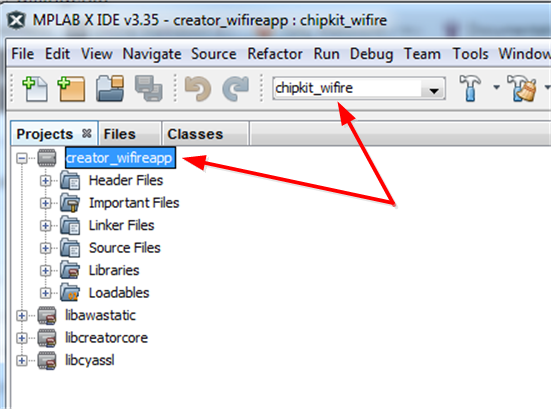
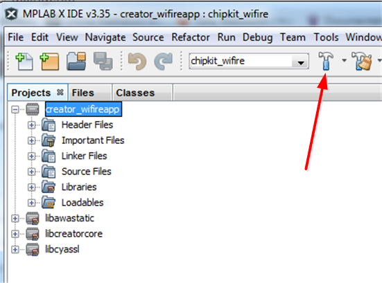
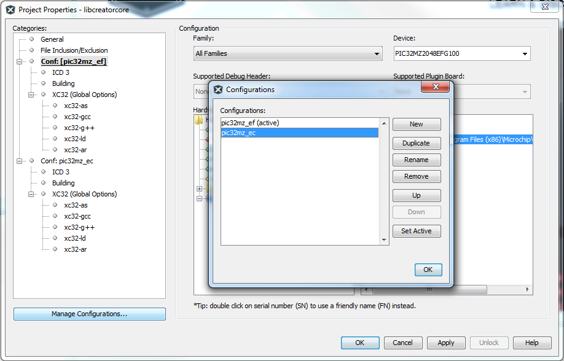
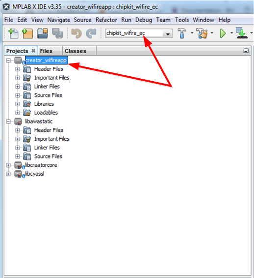
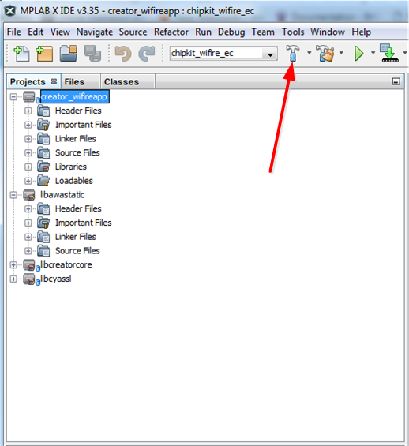

  

# Building the Creator WiFire application
----


## Objectives
The objective of this document is to guide the developer through a first time build of the Creator WiFire application. Instructions are provided for both Windows and Linux based systems.

## Requirements
This document assumes a development environment setup using the items listed below. All of the software tools are available for both Windows and Linux free of charge. For detailed setup instructions see [The WiFire developer environment](wiFireDeveloperEnvironment.md).  

**Note.** There are two WiFire development boards available, the EF, (the revision C board) and the EC, (the revision B board). The build process is similar in both cases with the exception that additional steps are required prior to building for the EC board. The differences are covered as they occur.
### Hardware
* Digilent ChipKIT WiFire development board (PIC32MZ2048EFG100 processor), EF or EC
* MPLAB ICD 3 – Microchip In-Circuit Debugger  
* Adaptor cable – to connect ICD to WiFire  
* USB cable – for the command console  

### Software and tools
* Git for [Windows](https://git-scm.com/download/win) or [Linux](https://git-scm.com/download/linux)
* XC32 v1.42 - C cross compiler for PIC microcontrollers  
* MPLABX IDE v3.35 - Microchip PIC integrated development environment  
* Harmony v1_07_01 - integrated firmware development platform for PIC32 microcontrollers  


### Building the WiFire application
Given that you have Git installed and that the recommended tools have been installed as per the above instructions, the WiFire project code can now be imported and built.

This process requires:  

* The WiFire application code, available on Github  
* Awa LightweightM2M, Imagination Technologies' open source implementation of the [Open Mobile Alliance's Lightweight M2M protocol](http://openmobilealliance.org/) for IoT connected devices.   

**Cloning the repositories**

1. **The WiFire application github repository:**  
Open a command prompt and navigate to your Harmony *apps* folder. If the above installation process has been used this should be: *C:\microchip\harmony\current\apps*  
Clone the repository:  
**C:\microchip\harmony\current\apps> git clone https://github.com/IMGCreator/creator-wifire-app.git**  
After cloning, the Wifire application firmware and libraries should be available in the *C:\microchip\harmony\current\apps\creator-wifire-app* folder.  

2. **The Awa LightweightM2M repository:**  
In your command prompt, navigate to your Harmony *third_party* folder, which should be: *C:\microchip\harmony\current\third_party*    
Clone the repository:  
**C:\microchip\harmony\current\third_party> git clone https://github.com/FlowM2M/AwaLWM2M.git**  
After cloning, the Awa LightweightM2M libraries should be available in the *C:\microchip\harmony\current\third_party\AwaLWM2M* folder.

There are two WiFire development boards available, the EC and the EF. The application has slightly different configuration and build requirements depending on the board used:  

* [Building for the EF board](https://github.com/CreatorDev/creator-wifire-app/blob/master/doc/BuildingTheWiFireApplication.md#building-the-wifire-application-code-for-the-first-time-using-the-ef-board)  
* [Building for the EC board](https://github.com/CreatorDev/creator-wifire-app/blob/master/doc/BuildingTheWiFireApplication.md#building-the-wifire-application-code-for-the-first-time-using-the-ec-board)  

### Building the WiFire application code for the first time using the EF board  

1. Create a *\bin\third_party* folder under *harmony\current* in which to build the application libraries:  
*C:\microchip\harmony\current\bin\third_party*  

2. Open MPLAB and open the library projects for *libawastatic*, *libcreatorcore* and *libcyassl*, using:  
`File > Open Project`  
In the dialogue box, navigate to *C:\microchip\harmony\current\apps\creator-wifire-app\lib\\*  
Select (ctrl+click), and open all of the following projects:  

    * libawastatic.X  - This project uses code from *third_party/AwaLWM2M*)
    * libcreatorcore.X  
    * libcyassl.X  


3. Open the application project:  
*C:\microchip\harmony\current\apps\creator-wifire-app\firmware\creator_wifireapp.X*  
Ensure that '*chipkit_wifire*' is selected as the main project (if you're using an EF WiFire board).  
**Note.** The load process may report the following errors:  
```  
Error: Project "creator_wifireapp" refers to file "bsp_config.h" which does not exist in the disk. The project failed to load.  
Error: Project "creator_wifireapp" refers to file "bsp_sys_init.c" which does not exist in the disk. The project failed to load.  
```  
The above errors may be ignored.  
  
4. Build the application.  
  


### Building the WiFire application code for the first time using the EC board 


1. Create a *\bin\third_party* folder under *harmony\current* in which to build the application libraries:  
*C:\microchip\harmony\current\bin\third_party*  
Copy the bsp folder provided for the EC from *C:\microchip\harmony\current\apps\creator-wifire-app\harmony\bsp* to *C:\microchip\harmony\current\bsp*.  
Allow the copy to replace any duplicate files.


2. Open MPLAB and open the library projects for *libawastatic*, *libcreatorcore* and *libcyassl*, using:  
`File > Open Project`  
In the dialogue box, navigate to *C:\microchip\harmony\current\apps\creator-wifire-app\lib\\*  
Select (ctrl+click), and open all of the following project libraries:  

    * libawastatic.X  - This project uses code from *third_party/AwaLWM2M*)
    * libcreatorcore.X  
    * libcyassl.X  		

	** The *EC config* for each of the above library projects must be made active in order to ensure the correct configuration for the EC board:**  
	
    * Right-click on the library project and select *properties* from the context menu
    * Click the *Manage Configurations* button in the Project Properties dialogue box   
    * Select *pic32mz_ec* in the Configurations dialogue and click the *Set Active* button  
    * Repeat for each project library  

	
3. Open the application project:  
*C:\microchip\harmony\current\apps\creator-wifire-app\firmware\creator_wifireapp.X*  
Ensure that '*chipkit_wifire_ec*' is selected as the main project.  
**Note.** The load process may report the following errors:  
`Error: Project "creator_wifireapp" refers to file "bsp_config.h" which does not exist in the disk. The project failed to load.`  
`Error: Project "creator_wifireapp" refers to file "bsp_sys_init.c" which does not exist in the disk. The project failed to load.`   
The above errors may be ignored.  
  

4. Build the application.  
  

---    
For further infomation please visit:  
* [The CreatorDev forum](Forum.creatordev.io)  
* [CreatorDev online documentation](Docs.creatordev.io/wifire)  

---

### Next

[Back to README](../README.md)  

### Previous  

[The WiFire developer environment](wiFireDeveloperEnvironment.md)  

----


----


