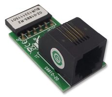
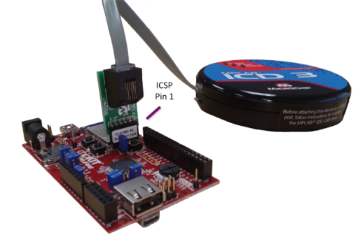
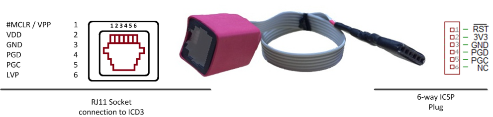
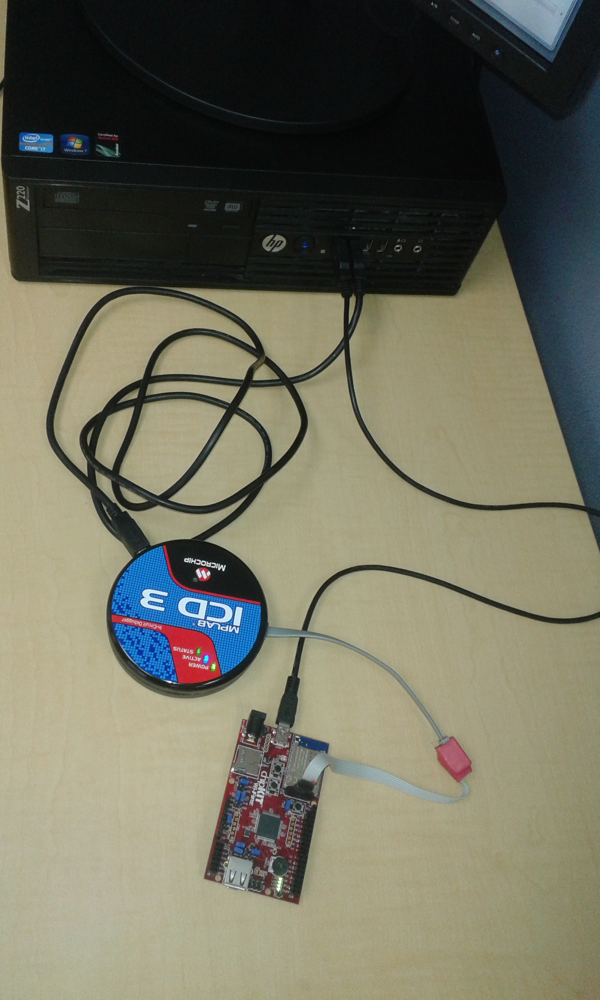
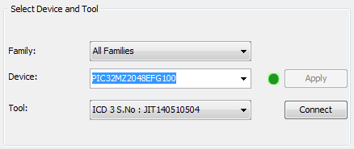

---

## Programming the WiFire board with the MPLAB ICD 3 In-Circuit Debugger using MPLAB IPE

To use Microchip’s [MPLAB® ICD3 In-circuit debugger tool](http://www.microchip.com/Developmenttools/ProductDetails.aspx?PartNO=DV164035) you'll need an appropriate adaptor board or cable to connect the ICD3 to the WiFire. The straight-through adaptor cable shown below ([Microchip part no. AC164110](http://www.digikey.co.nz/product-detail/en/microchip-technology/AC164110/AC164110-ND/1212490)) converts the RJ11 connection of the ICD3 to the 6-way inline connection of the WiFire.  

  

Alternatively you can make your own adaptor using the pinouts illustrated below.  

| RJ11 Socket Pin | 6-way Plug Conductor |  
|-----|-----|  
| 1	| 1 |  
| 2	| 2 |  
| 3	| 3 |  
| 4 | 4 |  
| 5	| 5 |  
| 6	| 6 |  

### Putting it all together 

*	Plug the programmer tool into a free USB port on the development PC.  
*	Plug the programmer’s 6-pin ICSP connection (or adaptor cable) into the 6-way ICSP header on your development board. For the WiFire this is connector ‘JP1’. 

  

**Note.** *In the above picture there's a further USB cable connecting the Mini-USB/UART connector of the Wifire board to a virtual COM port on the development PC. For details on how this is used see [WiFire hardware setup](wiFireHardwareSetup.md).*  

### Programming your device using MPLAB IPE

1. Start the MPLAB IPE application on your PC  
2. Select the board type from the drop down list in MPLAB IPE to match your version of WiFire board:  
  
3. Press the *Connect* button to connect the MPLAB IPE to your ICD programmer. Wait for any programmer firmware updates to be automatically run by MPLAB IPE.  
4. Press the *Browse* button for the Source field, then navigate to the hex file to be programmed and select it.  

5. If a dialog box is shown regarding debug information being cleared, press *OK* to continue.  
6. Press the *Program* button.  

7. Wait for the the hex file to be loaded and verified.  

----

----

