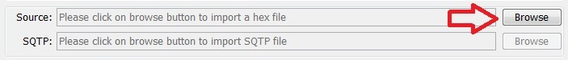

---

## Setting up the WiFire board with the PICkit™ 3 In-Circuit Debugger

### Programming environment

Before you can program applications on your WiFire board you will need a programming environment set up. Please refer to the Wi-Fire quick start guide.

After obtaining your selected programmer you can program the WiFire board with your application hex file. Alternatively, to try out your development environment you can try loading the Creator WiFire App hex file from the downloads site and run it.

### Programming a hex file

In these examples the chipKIT PICkit3 programmer is being used but the process is virtually identical for other programmers.

Steps:

1. Connect the PICkit3 programmer to JP1 on your WiFIRE board. Note that the white arrow on the PICKit3 programmer should be connected to pin 1 on JP1 identifiable with the square pad.  
  
2. Plug your programmer hardware into your development PC.  
3. Plug your WiFIRE board into your PC to power it and connect the programmer to the board.  
4. Start the MPLAB IPE application on your PC.  
5. Select the board type from the drop down list in MPLAB IPE to match your version of WiFIRE board.  
  
6. Press the connect in MPLAB IDE button to connect the app to your PICkit3 programmer. Wait for any programmer firmware updates to be automatically run by MPLAB IPE.  
  
7. Press the Browse button for the Source field, navigate to the hex file to be programmed and select it.  
  
8. If a dialog box is shown regarding debug information being cleared press the OK button to continue.  
9. Press the program button in the MPLAB IPE app.  
  
10. Wait for the the hex to be loaded to the WiFIRE board and verified.  
  

----

----

