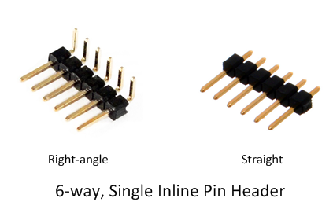
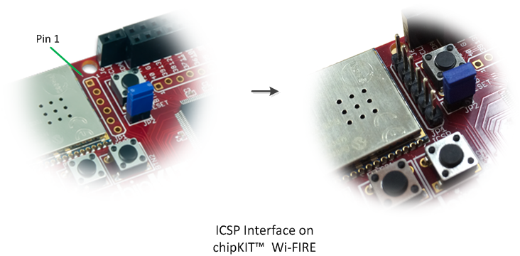


### Programming the WiFire

To program your WiFire board with the MPLAB® ICD3 you should connect it to the WiFire In-Circuit Serial Programming (ICSP) interface which is designated by the label ‘JP1’ and marked with the text ‘ICSP’.  

If your programming tool does not come with one already you will need to provide a 6-way single-inline pin header (0.1” / 2.54mm pitch) to connect the programmer to the WiFire device. These are easily available from a variety of electronic component suppliers and usually come in both the ‘right-angled’ and ‘straight’ varieties (either is suitable for use with the WiFire).  
 
  

The staggered positioning of the holes in the WiFire's ICSP interface allows the 6-way header an interference fit, so there should be no need to solder it into position unless a permanent connection is desired.  

**IMPORTANT.** *Pin-1 of the ICSP interface is marked with a ‘1’ character. Ensure that the Pin-1 of the programmer connector is aligned with the Pin-1 on the WiFire ICSP*.  

  

*	Plug the programmer tool into a free USB port on the development PC.  
*	Plug the programmer’s 6-pin ICSP connection (or adaptor cable) into the 6-way ICSP header on your development board. For the WiFire this is connector ‘JP1’.  
*	In MPLAB® X, right-click the project name of the target file and select ‘Properties’ from the context menu that appears.  
*	In the Project Properties dialog, select the appropriate programmer from the ‘Hardware Tool’ list box. For ICD3 select ‘ICD3’; for other programmer tool types, you may need to experiment to determine the correct setting for your device.  
*	Click ‘Apply’ to change to the selected programmer tool. Under the ‘Conf: [chipkit_wifire]’ (or ‘Conf: [chipkit_wifire_ec]’ if you have a Rev B board) entry in the project properties list you should see the name of the selected programmer tool appear.  
*	Select the name of the programmer tool, and under the tool’s ‘Options’ page, make sure the ‘Preserve Program Memory’ option is checked.  
*	Make sure the ‘Preserve Program Memory Start (hex)’ text box, has the entry 0x1d000000.  
*	Make sure the ‘Preserve Program Memory End (hex)’ text box, has the entry 0x1d1fffff.  
*	Click ‘OK’ to close the ‘Project Properties’ dialog.  

Next we must update the MPLAB® project to include the required Harmony source files. This is achieved using the MPLAB® X Harmony Code Configurator Plugin. The Plugin allows the developer to select and configure the individual elements of the Harmony Framework that they require for their embedded project. In our case the, skeleton app requires the configurator to add-in the source files for the Harmony TCP/IP stack and various low-level drivers. When developing your application, you can re-run the Harmony configurator tool at any time in order to add/remove parts of the Harmony Framework as required.

20.	Click ‘Tools’ … ‘Embedded’ … “MPLAB® Harmony Configurator”

21.	Verify that the Harmony path is correct for your installation: e.g. “C:\microchip\harmony\current” and click “OK”.

----

----

