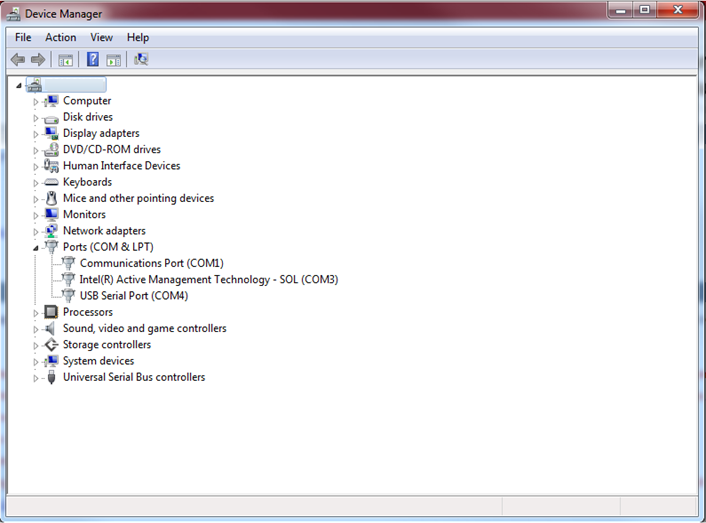
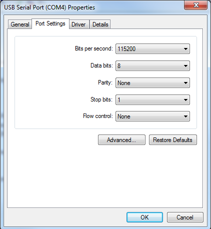
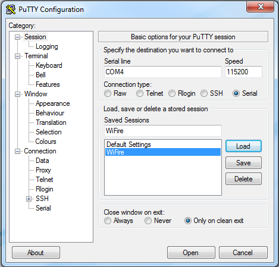
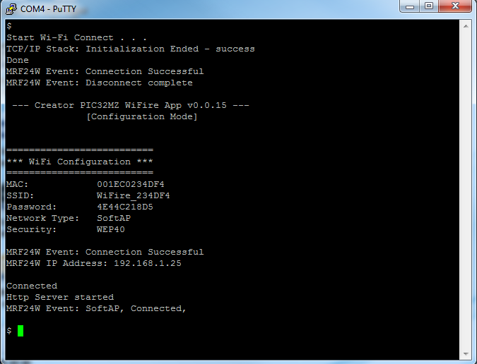
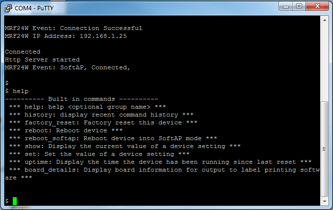
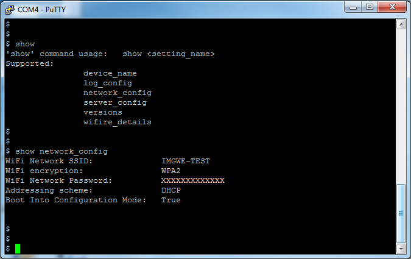
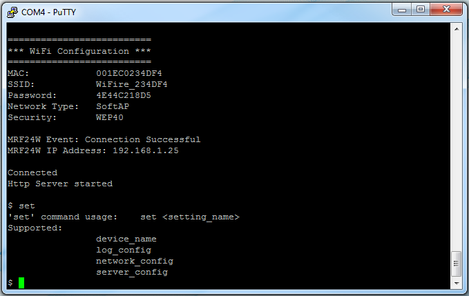
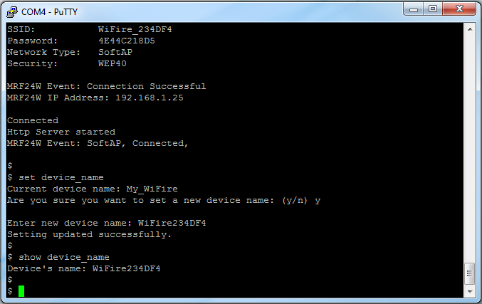



----

## WiFire hardware setup  
This section applies to the *ChipKIT WiFire development board* and describes:  

* WiFire hardware setup and virtual COM port configuration on a PC  
* Terminal configuration and the command line interface (CLI). *Note that all command line interface examples show the device in configuration mode although the same commands are also available in application mode*.  
* WiFire application supported commands  
  

### Virtual COM port setup  
The WiFire board can be powered and configured via its UART (a Mini-USB 2.0 female connector) by connecting to the USB port of a PC. In this case the UART must be configured as a virtual COM port by installing an appropriate device driver which is downloadable free as an .exe file from [ftdichip.com](http://www.ftdichip.com/Drivers/VCP.htm).  
Having installed the appropriate Virtual com Port (VCP) driver, open Windows Device Manager and expand the Ports (COM & LPT) menu:  

You'll see a USB Serial Port heading with an allocated COM port (1..4). Right click on the entry, select **Properties**, open the *Port Settings* tab and edit the settings as shown below:  

### Console setup  

You'll need a console to enable you to use the WiFire command line interface. We suggest [PuTTY](http://www.putty.org/), which is free to download.  

Once installed, you'll need to configure PuTTY for use...  

PuTTY opens on the configuration page. In the left panel under SSH, select *serial* and configure as in the settings shown below:  

  

**Note** that the *Serial line* entry (COM4) matches the USB serial port setup earlier. **This may be different on your system.**

We'd suggest that you also save this configuration under the name *WiFire*.  

Now click the *Open* button to create a new terminal session.  

Pressing the *reset* button on the WiFire device will initiate the command line.  

  

### WiFire commands  

Typing *help* returns a list of built-in WiFire commands...

  

Information about the status of the WiFire device is available through the *show* command...  

  

From the above it can be seen that typing *show* returns a list of all the device settings that can be accessed.  

The *set* command allows several WiFire device parameters to be overwritten...

  

As a further example, we'll change the device name using *set*, and then use the *show* command to read it back...  

  

It's worth playing around with the WiFire command line to familiarise yourself with its properties and settings.  

---   
For further information please visit:  
* [The CreatorDev forum](https://forum.creatordev.io)  
* [CreatorDev online documentation](https://docs.creatordev.io/wifire)  

---

### Next

[Read Me](../README.md)

### Previous

[Supported IPSO objects](supportedObjects.md) 

----
